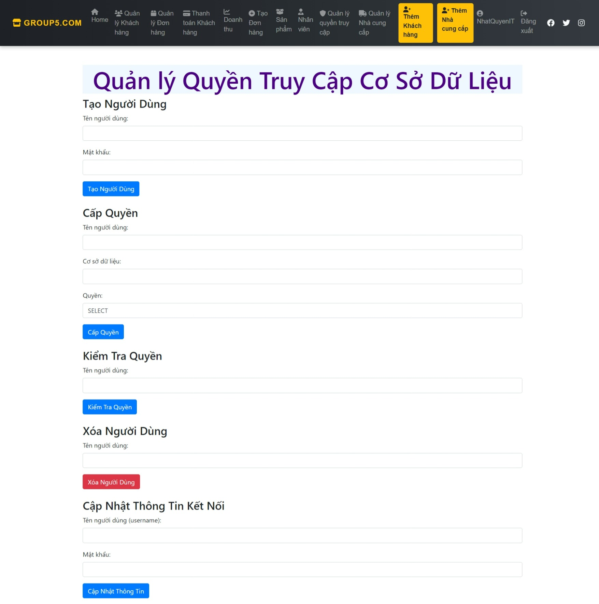

<!-- author: NhatQuyenIT -->
# Đồ án môn Cơ sở dữ liệu nâng cao (Advanced Database)
 Đề tài: Quản lý vải tại công ty (Fabric Agency Database)

## Instruction manual

1. Tải source code về:

   ```bash
   git clone https://github.com/NhatQuyenIT/DoAn-ADBS.git
   ```
2. Mở xampp và vào trang http://localhost/phpmyadmin/ tạo 1 database mới có tên là fabric_new và import cơ sở dữ liệu trong folder -> file fabric_new.sql trong source code.

3. Sử dụng trình duyệt để chạy source code trên http://localhost/DoAnFabricAgency/
### Tài khoản Admin
- Username: Admin
- Password: admin

### Giao diện
 
 
 <h4 align="center">Đăng nhập</h4>
 


 <h4 align="center">Trang chủ</h4>

 

 <h4 align="center">Quản lý khách hàng</h4>

  

 <h4 align="center">Quản lý đơn hàng</h4>

  

 <h4 align="center">Thanh toán khách hàng</h4>
 
  

 <h4 align="center">Thống kê doanh thu bán hàng</h4>
 
  

 <h4 align="center">Tạo đơn hàng mới</h4>
 
  

 <h4 align="center">Danh sách sản phẩm</h4>

  

 <h4 align="center">Danh sách nhân viên</h4>

  

 <h4 align="center">Quản lý nhà cung cấp</h4>

  

 <h4 align="center">Thêm khách hàng</h4>

   

 <h4 align="center">Thêm nhà cung cấp</h4>

 

 <h4 align="center">Phân Quyền Người Dùng</h4>